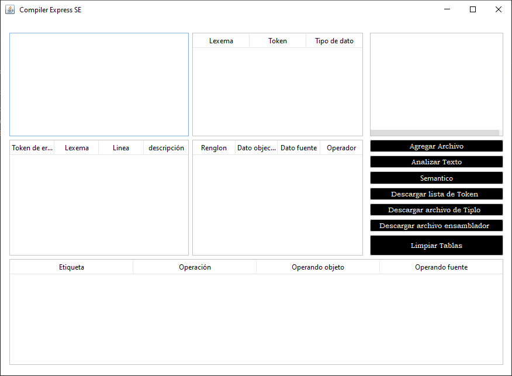

# HybriSE Compiler

The HybriSE Compiler is a powerful tool for compiling programs in various programming languages. Based on the reduced architecture of JarCEAM 8.2, this compiler offers a flexible and modular platform, with powerful optimization techniques for an efficient and streamlined compilation process.

## Screenshots

### Main Interface

## Features

- Generation of optimized code.
- Detection of lexical and semantic errors.
- Generation of symbol table.
- Generation of assembly code.
- Two execution modes: normal and extended.
- Generation of tiple table.

## System Requirements

- Java Development Kit (JDK) 1.8 or higher.
- NetBeans IDE (recommended version: 8.2 or higher).
- Internet connection to download dependencies and updates.

## Project Setup

1. Clone or download this repository to your local machine.
2. Open NetBeans IDE and select "File" -> "Open Project".
3. Navigate to the location where you cloned or downloaded the repository and select it.
4. The project will open in NetBeans IDE.
5. Configure the necessary dependencies, ensuring that you have access to the required libraries and the appropriate version of Java.

## Contributing

Contributions are welcome! If you have any ideas, suggestions, or bug reports, please open an issue or submit a pull request.

## License

This project is licensed under the [MIT License](LICENSE).
